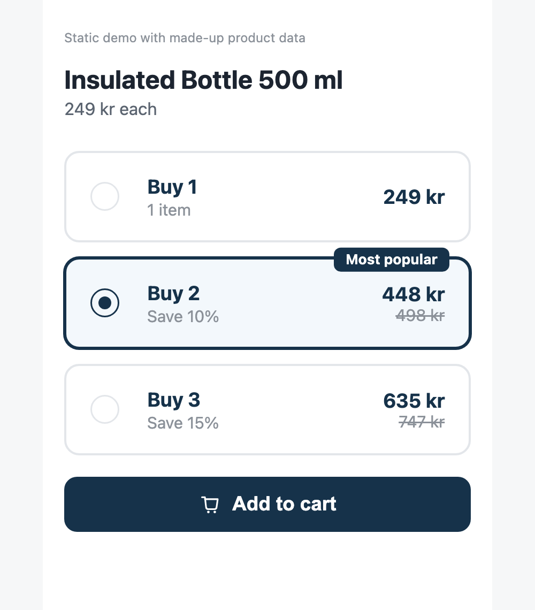
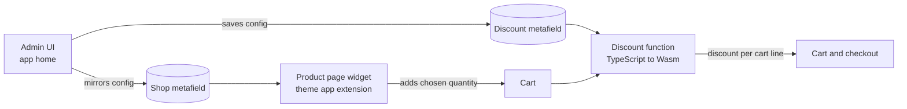

# Shopify volume discounts

A small Shopify app for "buy more, save more" offers. It shows the offers as selectable cards on the product page and applies the matching discount in the cart and at checkout.

It runs entirely on Shopify: there is no server to host and no database.

<p align="center">
  
</p>

## Why I built it

I built this for my own D2C store, where quantity offers were a central part of the product page. I wanted three things at once:

- **Control over the offer itself.** Which quantity is preselected, what the badge says, and whether the strikethrough price is based on the regular price or the compare-at price are all pricing decisions, and I wanted to change them without touching code.
- **The price on the product page to be the price at checkout.** Both are calculated from the same saved configuration.
- **No running costs or moving parts.** Everything is stored in Shopify metafields and executed by Shopify.

## How it works



1. **The merchant sets up offers in the admin UI**: quantity, discount (percentage or fixed amount), title, subtitle, badge and which offer is preselected.
2. **Saving writes the same JSON to two metafields.** One sits on the discount, where the function reads it. The other sits on the shop, where the storefront can read it.
3. **The widget renders the offers on the product page.** Prices are rendered server-side in Liquid and recalculated in the browser when the customer switches variant. The button adds the chosen quantity through the Ajax Cart API.
4. **The Shopify Function applies the discount.** For each cart line it picks the highest tier the quantity reaches and returns a product discount for that line. The function decides the price; the widget only presents it.

Colours, sizes and what happens after add-to-cart are block settings in the theme editor, so they can be adjusted with live preview.

## What is in the repository

| Path | What it is |
|---|---|
| [`extensions/volume-discount`](extensions/volume-discount) | The Shopify Function that calculates the discount, with unit tests |
| [`extensions/bundle-widget`](extensions/bundle-widget) | Theme app extension: the Liquid block, stylesheet and script for the product page |
| [`extensions/admin-home`](extensions/admin-home) | Admin UI for creating, editing, pausing and deleting discounts (Preact and Polaris web components) |
| [`extensions/volume-discount-settings`](extensions/volume-discount-settings) | A minimal settings block on Shopify's own discount page |
| [`demo`](demo) | A static page that runs the real widget stylesheet and script with made-up data |

## Try it

The widget can be tried without a Shopify store. Open `demo/index.html` in a browser.

To run the tests for the discount function:

```shell
npm install
npm run typegen
npm test
```

To run the whole app you need a Shopify Partner account, a development store and the [Shopify CLI](https://shopify.dev/docs/apps/tools/cli):

```shell
npm install
npx shopify app config link
npx shopify app dev
```

`client_id` in `shopify.app.toml` is left empty on purpose. `shopify app config link` fills it in for your own app.

## Tests

The function is a pure function from cart and configuration to discount operations, so it is tested without Shopify. The tests cover:

- an empty cart, a missing configuration and invalid JSON
- quantities below the lowest tier
- picking the highest tier reached
- several cart lines where only some qualify
- percentage and fixed-amount discounts
- both configuration formats the function accepts

## Limitations

- **Tiers are counted per cart line.** Two different variants of the same product do not add up to a "Buy 2" tier.
- **One widget configuration per shop.** The most recently saved discount is the one the product page shows.
- **The settings block on Shopify's discount page is the older, simpler UI.** It handles percentage tiers only, and saving from it does not update the widget. The admin UI in `admin-home` is the one to use.
- **The cart drawer integration targets Shopify's Horizon themes.** On other themes the widget sends the customer to the cart page instead.
- **The admin UI is in English only.**

## How it was built

I am not a software engineer by trade. I wrote this with [Claude Code](https://claude.com/claude-code): I decided what the app should do, tested it in my store and worked through the edge cases that showed up there, and the AI wrote most of the code.

This public version is a cleaned-up copy of the app I ran. Store-specific names are removed and the texts are in English.

## License

[MIT](LICENSE)
